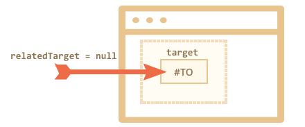
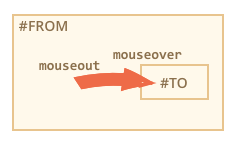

# Мышь: движение mouseover/out, mouseenter/leave

В этой главе мы рассмотрим события, возникающие при движении мыши над элементами.

## События mouseover/mouseout, свойство relatedTarget

Событие `mouseover` происходит, когда мышь появляется над элементом, а `mouseout` -- когда уходит из него.


При этом мы можем узнать, с какого элемента пришла (или на какой ушла) мышь, используя дополнительное свойство объекта события `relatedTarget`.

Например, в обработчике события `mouseover`:

- `event.target` -- элемент, на который пришла мышь, то есть на котором возникло событие.
- `event.relatedTarget` -- элемент, с которого пришла мышь.

Для `mouseout` всё наоборот:

- `event.target` -- элемент, с которого ушла мышь, то есть на котором возникло событие.
- `event.relatedTarget` -- элемент, на который перешла мышь.

В примере ниже, если у вас есть мышь, вы можете наглядно посмотреть события `mouseover/out`, возникающие на всех элементах.

[codetabs src="mouseoverout" height=220]

```warn header="`relatedTarget` может быть `null`"
Свойство `relatedTarget` может быть равно `null`.

Это вполне нормально и означает, что мышь пришла не с другого элемента, а из-за пределов окна (или ушла за окно). Мы обязательно должны иметь в виду такую возможность, когда пишем код, который обращается к свойствам `event.relatedTarget`.
```

## Частота событий

Событие `mousemove` срабатывает при передвижении мыши. Но это не значит, что каждый пиксель экрана порождает отдельное событие!

События `mousemove` и `mouseover/mouseout` срабатывают так часто, насколько это позволяет внутренняя система взаимодействия с мышью браузера.

Это означает, что если посетитель двигает мышью быстро, то DOM-элементы, через которые мышь проходит на большой скорости, могут быть пропущены.


При быстром движении с элемента `#FROM` до элемента `#TO`, как изображено на картинке выше -- промежуточные `<DIV>` будут пропущены. Сработает только событие `mouseout` на `#FROM` и `mouseover` на `#TO`.

На практике это полезно, потому что таких промежуточных элементов может быть много, и если обрабатывать заход и уход с каждого, будут дополнительные вычислительные затраты.

С другой стороны, мы должны это понимать и не рассчитывать на то, что мышь аккуратно пройдёт с одного элемента на другой и так далее. Нет, она "прыгает".

В частности, возможна ситуация, когда курсор прыгает в середину страницы, и при этом `relatedTarget=null`, то есть он пришёл "ниоткуда" (на самом деле извне окна):



Обратим внимание ещё на такую деталь. При быстром движении курсор окажется над `#TO` сразу, даже если этот элемент глубоко в DOM. Его родители при движении сквозь них события не поймают.

```online
Попробуйте увидеть это "вживую" на тестовом стенде ниже.

Его HTML представляет собой два вложенных `div'а`.

Молниеносно проведите мышью над вложенными элементами. При этом может не быть ни одного события или их получит только красный `div`, а может быть только зеленый.

А еще попробуйте зайти курсором мыши на красный `div` и потом быстро вывести мышь из него куда-нибудь сквозь зеленый. Если движение мыши достаточно быстрое, то родительский элемент будет проигнорирован.

[codetabs height=360 src="mouseoverout-fast"]
```

Важно иметь в виду эту особенность событий, чтобы не написать код, который рассчитан на последовательный проход над элементами. В остальном это вполне удобно.

## "Лишний" mouseout при уходе на потомка

Представьте ситуацию -- курсор зашёл на элемент. Сработал `mouseover` на нём. Потом курсор идёт на дочерний... И, оказывается, на элементе-родителе при этом происходит `mouseout`! Как будто курсор с него ушёл, хотя он всего лишь перешёл на потомка.

**При переходе на потомка срабатывает `mouseout` на родителе.**



Это кажется странным, но легко объяснимо.

**Согласно браузерной логике, курсор мыши может быть только над *одним* элементом -- самым глубоким в DOM (и верхним по z-index).**

Так что если он перешел куда-нибудь, то автоматически ушёл с предыдущего элемента. Всё просто.

Самое забавное начинается чуть позже.

Ведь события `mouseover` и `mouseout` всплывают.

Получается, что если поставить обработчики `mouseover` и `mouseout` на `#FROM` и `#TO`, то последовательность срабатывания при переходе `#FROM` -> `#TO` будет следующей:

1. `mouseout` на `#FROM` (с `event.target=#FROM`, `event.relatedTarget=#TO`).
2. `mouseover` на `#TO` (с `event.target=#TO`, `event.relatedTarget=#FROM`).
3. Событие `mouseover` после срабатывания на `#TO` всплывает выше, запуская обработчики `mouseover` на родителях. Ближайший родитель -- как раз `#FROM`, то есть сработает обработчик `mouseover` на нём, с теми же значениями `target/relatedTarget`.

Если посмотреть на `1)` и `3)`, то видно, что на `#FROM` сработает сначала `mouseout`, а затем с `#TO` всплывёт `mouseover`.

Если по `mouseover` мы что-то показываем, а по `mouseout` -- скрываем, то получится "мигание".

**У обработчиков создаётся впечатление, что курсор ушёл `mouseout` с родителя, а затем тут же перешёл `mouseover` на него (за счёт всплытия `mouseover` с потомка).**

```online
Это можно увидеть в примере ниже. В нём красный `div` вложен в синий. На синем стоит обработчик, который записывает его `mouseover/mouseout`.

Зайдите на синий элемент, а потом переведите мышь на красный -- и наблюдайте за событиями:

[codetabs height=360 src="mouseoverout-child"]

1. При заходе на синий -- на нём сработает `mouseover [target: blue]`.
2. При переходе с синего на красный -- будет `mouseout [target: blue]` -- уход с родителя.
3. ...И тут же `mouseover [target: red]` -- как ни странно, "обратный переход" на родителя.

На самом деле, обратного перехода нет. Событие `mouseover` сработало на потомке (видно по `target: red`), а затем всплыло.
```

Если действия при наведении и уходе курсора с родителя простые, например скрытие/показ подсказки, то можно вообще ничего не заметить. Ведь события происходят сразу одно за другим, подсказка будет скрыта по `mouseout` и тут же показана по `mouseover`.

Если же происходит что-то более сложное, то бывает важно отследить момент "настоящего" ухода, то есть понять, когда элемент зашёл на родителя, а когда ушёл -- без учёта переходов по дочерним элементам.

Для этого можно использовать события `mouseenter/mouseleave`, которые мы рассмотрим далее.

## События mouseenter и mouseleave

События `mouseenter/mouseleave` похожи на `mouseover/mouseout`. Они тоже срабатывают, когда курсор заходит на элемент и уходит с него, но с двумя отличиями.

1. Не учитываются переходы внутри элемента.
2. События `mouseenter/mouseleave` не всплывают.

Эти события более интуитивно понятны.

Курсор заходит на элемент -- срабатывает `mouseenter`, а затем -- неважно, куда он внутри него переходит, `mouseleave` будет, когда курсор окажется за пределами элемента.

```online
Вы можете увидеть, как они работают проведя курсором над голубым `DIV'ом` ниже. Обработчик стоит только на внешнем, синем элементе. Обратите внимание -- лишних событий при переходе на красного потомка нет!

[codetabs height=340 src="mouseleave"]
```

## Делегирование

События `mouseenter/leave` более наглядны и понятны, но они не всплывают, а значит с ними нельзя использовать делегирование.

Представим, что нам нужно обработать вход/выход мыши для ячеек таблицы. А в таблице таких ячеек тысяча.

Естественное решение -- поставить обработчик на верхний элемент `<table>` и ловить все события в нём. Но события `mouseenter/leave` не всплывают, они срабатывают именно на том элементе, на котором стоит обработчик и только на нём.

Если обработчики `mouseenter/leave` стоят на `<table>`, то они сработают при входе-выходе из таблицы, но получить из них какую-то информацию о переходах по её ячейкам невозможно.

Не беда -- воспользуемся `mouseover/mouseout`.

Простейший вариант обработчиков выглядит так:

```js
table.onmouseover = function(event) {
  var target = event.target;
  target.style.background = 'pink';
};

table.onmouseout = function(event) {
  var target = event.target;
  target.style.background = '';
};
```

```online
[codetabs height=480 src="mouseenter-mouseleave-delegation"]
```

В таком виде они срабатывают при переходе с любого элемента на любой. Нас же интересуют переходы строго с одной ячейки `<td>` на другую.

Нужно фильтровать события.

Один из вариантов:

- Запоминать текущий подсвеченный `<td>` в переменной.
- При `mouseover` проверять, остались ли мы внутри того же `<td>`, если да -- игнорировать.
- При `mouseout` проверять, если мы ушли с текущего `<td>`, а не перешли куда-то внутрь него, то игнорировать.

```offline
Детали кода вы можете посмотреть в [полном примере](sandbox:mouseenter-mouseleave-delegation-2).
```

```online
Детали кода вы можете посмотреть в примере ниже, который демонстрирует этот подход:

[codetabs height=380 src="mouseenter-mouseleave-delegation-2"]

Попробуйте по-разному, быстро или медленно заходить и выходить в ячейки таблицы. Обработчики `mouseover/mouseout` стоят на `table`, но при помощи делегирования корректно обрабатывают вход-выход.
```

## Особенности IE8-

В IE8- нет свойства `relatedTarget`. Вместо него используется `fromElement` для `mouseover` и `toElement` для `mouseout`.

Можно "исправить" несовместимость с `relatedTarget` так:

```js
function fixRelatedTarget(e) {
  if (e.relatedTarget === undefined) {
    if (e.type == 'mouseover') e.relatedTarget = e.fromElement;
    if (e.type == 'mouseout') e.relatedTarget = e.toElement;
  }
}
```

## Итого

У `mouseover, mousemove, mouseout` есть следующие особенности:

- При быстром движении мыши события `mouseover, mousemove, mouseout` могут пропускать промежуточные элементы.
- События `mouseover` и `mouseout` -- единственные, у которых есть вторая цель: `relatedTarget` (`toElement/fromElement` в IE).
- События `mouseover/mouseout` подразумевают, что курсор находится над одним, самым глубоким элементом. Они срабатывают при переходе с родительского элемента на дочерний.

События `mouseenter/mouseleave` не всплывают и не учитывают переходы внутри элемента.

