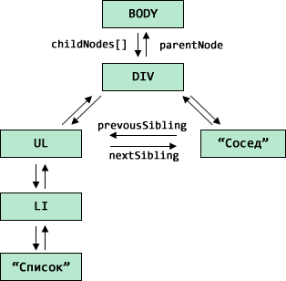
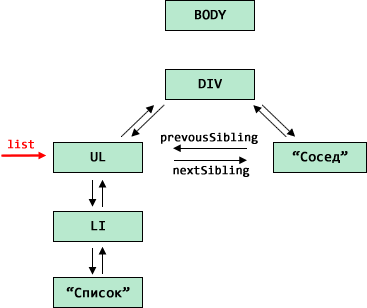

# Очистка памяти при removeChild/innerHTML

Управление памятью в случае с DOM работает по сути так же, как и с обычными JavaScript-объектами. Пока объект достижим -- он остаётся в памяти.

Но есть и особенности, поскольку DOM весь переплетён ссылками.

## Пример
Для примера рассмотрим следующий HTML:

```html
<html>

<body>
  <div>
    <ul>
      <li>Список</li>
    </ul>
    Сосед
  </div>
</body>

</html>
```

Его DOM (показаны только основные ссылки):



## Удаление removeChild

Операция `removeChild` разрывает все связи между удаляемым узлом и его родителем.

Поэтому, если удалить `DIV` из `BODY`, то всё поддерево под `DIV` станет недостижимым и будет удалено.

А что происходит, если на какой-то элемент внутри удаляемого поддерева есть ссылка?

Например, `UL` сохранён в переменную `list`:

```js
var list = document.getElementsByTagName('UL')[0];
document.body.removeChild(document.body.children[0]);
```

В этом случае, так как из этого `UL` можно по ссылкам добраться до любого другого места DOM, то получается, что все объекты по-прежнему достижимы и должны остаться в памяти:



То есть, DOM-объекты при использовании `removeChild` работают по той же логике, что и обычные объекты.

## Удаление через innerHTML

А вот удаление через очистку `elem.innerHTML="..."` браузеры интерпретируют по-разному.

По идее, при присвоении `elem.innerHTML=html` из DOM должны удаляться предыдущие узлы и добавляться новые,  из указанного `html`. Но стандарт ничего не говорит о том, что делать с узлами после удаления. И тут разные браузеры имеют разное мнение.

Посмотрим, что произойдёт с DOM-структурой при очистке `BODY`, если на какой-либо элемент есть ссылка.

```js
var list = document.getElementsByTagName('UL')[0];
document.body.innerHTML = "";
```

Обращаю внимание -- связь разрывается только между `DIV` и `BODY`, т.е. на верхнем уровне, а `list` -- это произвольный элемент.

Чтобы увидеть, что останется в памяти, а что нет -- запустим код:

```html run
<div>
  <ul>
    <li>Список</li>
  </ul>
  Сосед
</div>

<script>
  var list = document.getElementsByTagName('ul')[0];
  document.body.innerHTML = ''; // удалили DIV

  alert( list.parentNode ); // цела ли ссылка UL -> DIV ?
  alert( list.nextSibling ); // живы ли соседи UL ?
  alert( list.children.length ); // живы ли потомки UL ?
</script>
```

Как ни странно, браузеры ведут себя по-разному:

<table>
<thead>
<tr><th></th>
<th><code>parentNode</code></th>
<th><code>nextSibling</code></th>
<th><code>children.length</code></th>
</tr>
</thead>
<tbody>
<tr>
<td>Chrome/Safari/Opera</td>
<td><code>null</code></td>
<td><code>null</code></td>
<td><code>1</code></td>
</tr>
<tr>
<td>Firefox</td>
<td>узел DOM</td>
<td>узел DOM</td>
<td><code>1</code></td>
</tr>
<tr>
<td>IE 11-</td>
<td><code>null</code></td>
<td><code>null</code></td>
<td><code>0</code></td>
</tr>
</tbody>
</table>

Иными словами, браузеры ведут себя с различной степенью агрессивности по отношению к элементам.

Firefox
: Главный пацифист. Оставляет всё, на что есть ссылки, т.е. элемент, его родителя, соседей и детей, в точности как при `removeChild`.

Chrome/Safari/Opera
: Считают, что раз мы задали ссылку на `UL`, то нам нужно только это поддерево, а остальные узлы (соседей, родителей) можно удалить.

Internet Explorer
: Как ни странно, самый агрессивный. Удаляет вообще всё, кроме узла, на который есть ссылка. Это поведение одинаково для всех версий IE.

На иллюстрации ниже показано, какую часть DOM оставит каждый из браузеров:


## Итого

Если на какой-то DOM-узел есть ссылка, то:

- При использовании `removeChild` на родителе (или на этом узле, не важно) все узлы, достижимые из данного, остаются в памяти.

    То есть, фактически, в памяти может остаться большая часть дерева DOM. Это даёт наибольшую свободу в коде, но может привести к большим "утечкам памяти" из-за сохранения данных, которые реально не нужны.
- При удалении через `innerHTML` браузеры ведут себя с различной степенью агрессивности. Кросс-браузерно гарантировано одно: сам узел, на который есть ссылка, останется в памяти.

    Поэтому обращаться к соседям и детям узла, предок которого удалён через присвоение `innerHTML`, нельзя.

